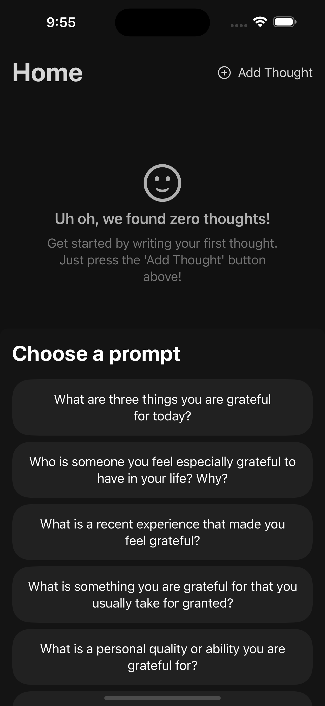
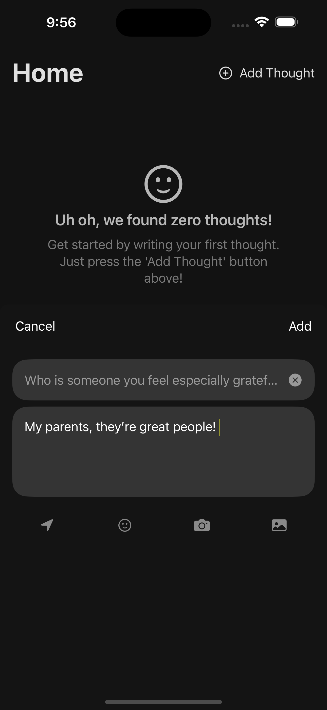
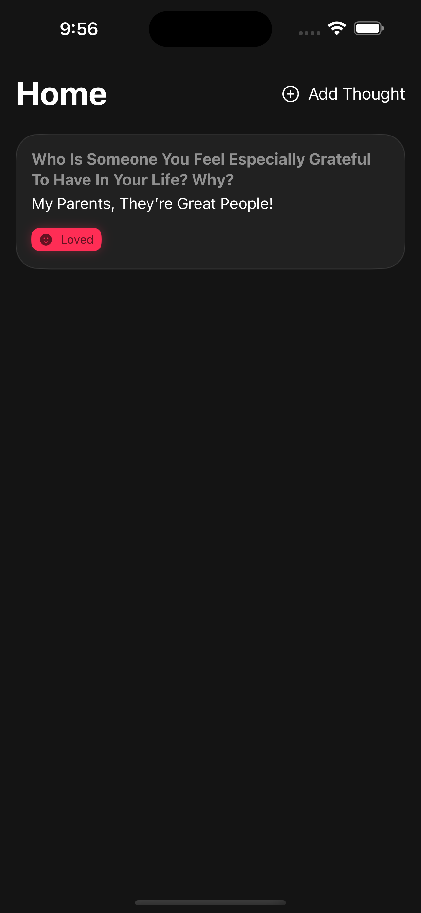
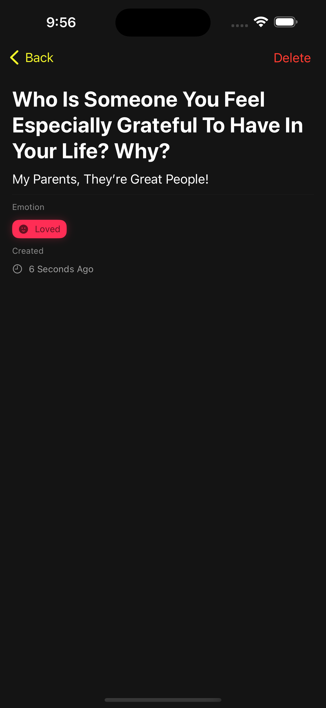

<div align="center">


<h1>Thoughtful (Beta)</h1>

<p>
A gratitude-focused mobile app that prompts users to reflect on and appreciate daily moments of positivity
</p>


<i>
This project is a parallel effort to <a href="https://github.com/nabilridhwan/Thoughtful">Thoughtful (Flutter)</a> and is currently in progress. The app
is NOT YET available in the Apple App Store.
</i>

</div>

## Screenshots

<p float="left">










</p>

## Features

- Daily prompts to reflect on positive moments
- Customizable prompts
- Privacy-focused (no data is stored on the cloud, all data is stored locally on the device)

## Technology Used

- Swift
- SwiftUI
- SwiftData

## Development

This project uses SwiftFormat to enforce code style.

1. To install SwiftFormat, run the following command:

```bash
brew install swiftformat
```

2. Follow these [steps](https://github.com/nicklockwood/SwiftFormat?tab=readme-ov-file#git-pre-commit-hook) to install a
   pre-commit hook for swiftformat.
