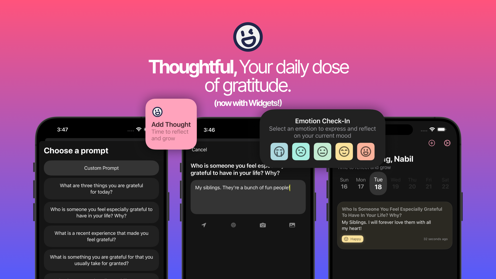

<div align="center" style="margin: 20px 0;">

<h1>Thoughtful</h1>

<p>
A gratitude-focused mobile app that prompts users to reflect on and appreciate daily moments of positivity
</p>


<i>
This project is a continuation of <a href="https://github.com/nabilridhwan/Thoughtful">Thoughtful (Flutter)</a> and is currently in progress. The app
is NOT YET available in the Apple App Store. Thoughtful (Flutter) will be discontinued once this project is completed.
</i>

</div>

<br />



## Features

- Handcrafted prompts to reflect on positive moments in life
- Custom prompts
- Cool-looking Widgets, making your journey to gratitude more fun
- Privacy-focused (ALL data stored locally on the device)

## Technologies Used

- Swift
- SwiftUI
- SwiftData
- TipKit
- WidgetKit

## Attributions

Thoughtful is grateful for the following open-source projects that helped make this app possible, whether it is through
code, design, or inspiration:

- App Icon: [MingCute](https://github.com/Richard9394/MingCute)
- Emotion Icons: [MingCute](https://github.com/Richard9394/MingCute)

## Contributing

> [!WARNING]
> - Thoughtful is a **freemium revenue model** app. While the core features are free, we offer additional Premium
    features available through in-app purchases.
> - Contributions are highly valued and will be listed under "Attributions" section within the app.

> [!IMPORTANT]
> - Any **code** contribution to this project assumes that you understand the goal of the application and the features
    it offers.
    File an issue if you have any questions.
> - If you're not tech-savvy, you could contribute by helping us with translations. Please file an issue if you're
    interested.

This project uses SwiftFormat to enforce code style.

1. To install SwiftFormat, run the following command:

```bash
brew install swiftformat
```

2. Follow these [steps](https://github.com/nicklockwood/SwiftFormat?tab=readme-ov-file#git-pre-commit-hook) to install a
   pre-commit hook for swiftformat.
